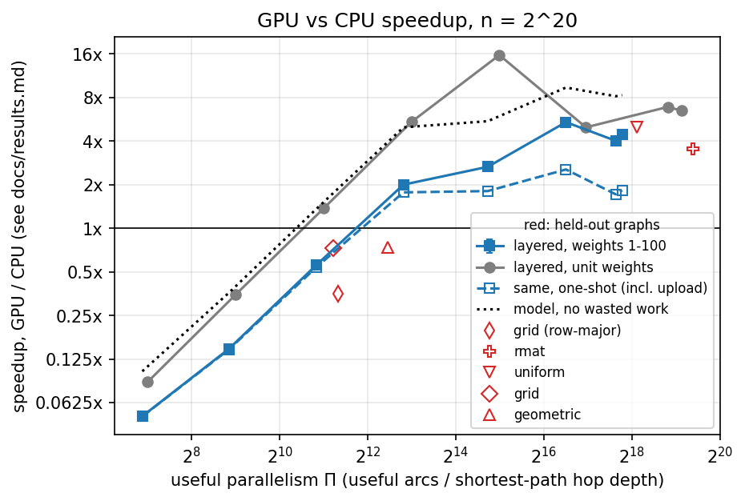

# When Does GPU Parallelism Actually Pay?

This repository has nine single source shortest path solvers, five for the CPU
and four for CUDA GPUs, behind one benchmark program. It also has the scripts
that run a set of experiments on an RTX 4090 and an i9 13900KF to find out which
graphs the GPU is actually faster on. The short answer is that it depends on how
much useful work the GPU gets between synchronizations, as the plot below shows.
The docs folder explains the results and methods in detail.



## Requirements

You need a C++17 compiler with OpenMP and GNU make. CUDA is optional, and
without it the GPU solvers are simply left out. The analysis and plots need
Python 3 with pandas, numpy, scipy and matplotlib.

## Building and testing

```
make          # builds bin/bench, bin/gen_graph, bin/calibrate and bin/test_sssp
make test     # checks every solver against an independent O(V*E) reference
make cpu      # builds without CUDA
make smoke    # the tests, then the pipeline on one tiny graph (about 5 s)
```

## Running the experiments

`tools/experiments.py` runs every experiment except F. For each graph it
generates the graph, runs the benchmark on it, and deletes it again, so only one
graph is on disk at a time. It waits while another process is using the GPU, and
if it is stopped it picks up where it left off. Raw results go to
`results/raw/<experiment>/`. On an idle GPU the whole run takes about two hours.

```
make reproduce                             # tests, C0 to T, analysis and plots
python3 tools/experiments.py C0 A          # just calibration and experiment A
python3 tools/experiments.py --list        # print every command without running it
python3 tools/experiments.py --quick all   # a tiny version to check the pipeline
```

Each experiment changes one thing and keeps the rest fixed.

```
C0   microbenchmarks that measure the cost of a GPU synchronization, copy
     bandwidth and OpenMP overhead, and pick the CPU thread count
A    layered graphs of fixed size where only the layer width changes, which
     sets how much parallel work each round has
B    a random graph with one hub of growing degree, to see how badly each GPU
     solver handles one very long adjacency list
C    a uniform graph and a grid, each with seven weight distributions on the
     same edges, to see how much extra work the unordered GPU solver does and
     when ordering pays off
D    many queries on a graph that stays on the GPU, compared with answering
     the same queries on all CPU cores at once
E    graph size from 2^16 to 2^24 vertices, which crosses the CPU and GPU
     cache sizes
HO   grid, geometric, uniform and RMAT graphs that are never used for fitting
     and serve as a test set
T    runs that time every kernel, used only for the time breakdown plot
```

Experiment F is run separately with `tools/profile.sh`. It collects hardware
counters with Nsight Compute, Nsight Systems and perf, of which Nsight Compute
and perf need sudo on this machine, and it times the serial CPU solvers pinned
to one P core and unpinned.

## Analysis and plots

```
make analyze    # checks results/raw and writes results/published
make figures    # draws the plots in docs/figures from results/published
```

If a check fails, for example a wrong distance array or a GPU run that shared
the GPU with another process, `tools/analyze.py` writes only `validation.md` and
stops.

## What the results folders contain

`results/raw` has one folder per benchmark run. Each holds `runs.csv` with the
machine and settings, `graphs.csv` with the graph parameters and statistics,
`sources.csv` with statistics for each source vertex, and `samples.csv` with one
row per solver run, including every timing phase and work counter. Batch runs
also have `batch.csv` and calibration runs have `calibration.csv`.
`results/raw/F` holds the profiler output. This data is never edited, and
`results/experiments.log` and `results/profile.log` are the logs of the runs
that produced it.

`results/published` is regenerated by `make analyze`.

```
summary.md          every table below in readable form
validation.md       the checks run on the raw data and their outcome
per_source.csv      best CPU and best GPU time for each graph and source
per_graph.csv       the same averaged over sources, with 95% confidence intervals
per_solver.csv      every solver's median time and work on every graph
constants.csv       the calibrated costs from C0
model.csv           the fitted GPU cost model and its error on each experiment
device_choice.csv   how well simple rules predict which device is faster
amortization.csv    queries needed before keeping the graph on the GPU pays off
sync_cost.csv       data for the time per synchronization plot (A)
skew.csv            data for the degree skew plot (B)
weights.csv         data for the weight distribution plot (C)
scaling.csv         data for the size plot (E)
time_breakdown.csv  data for the time breakdown plot (T), and times without kernel events
profile_gpu.csv     hardware counters for eight GPU kernels
profile_cpu.csv     hardware counters for the CPU solvers
placement.csv       serial CPU solvers pinned to a P core versus unpinned
```

Graphs are not stored. They are regenerated exactly from the parameters saved
with each result.

## Running the benchmark by hand

```
bin/gen_graph --topo uniform --n 1048576 --m 4194304 --out graphs/u.bin
bin/bench graphs/u.bin --sources 8 --reps 5 --out results/raw/adhoc
bin/bench --list     # the solver names
bin/bench --help     # every option
```

## Documentation

`docs/results.md` describes each experiment and what it found.
`docs/methodology.md` covers how runs are timed and checked and how the numbers
are computed. `docs/architecture.md` describes the code.
