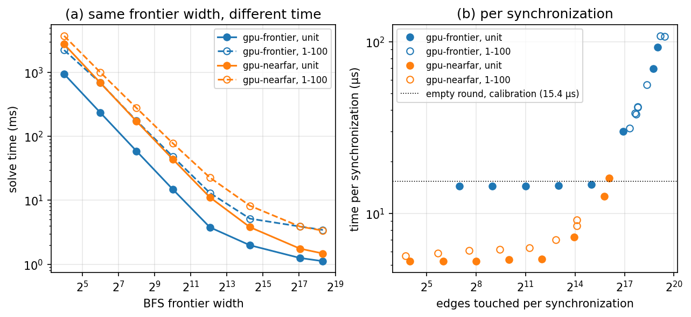
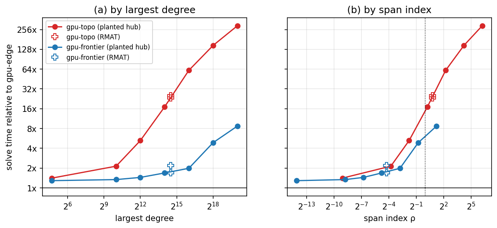
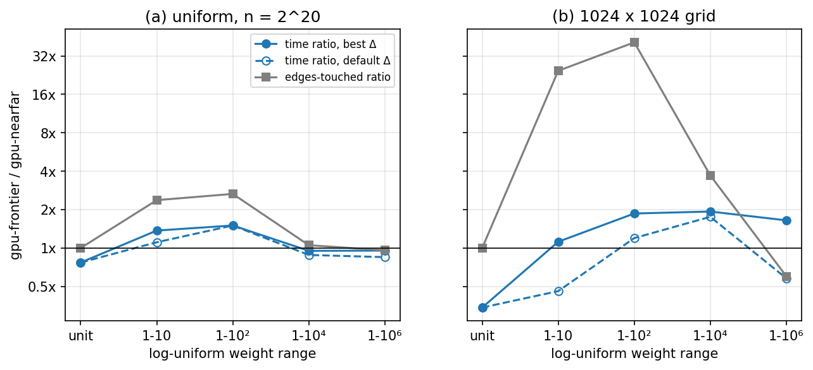
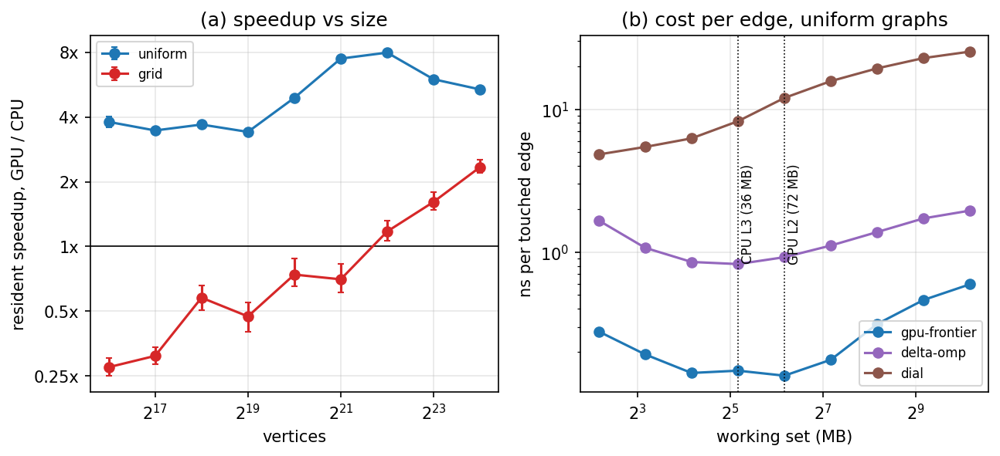
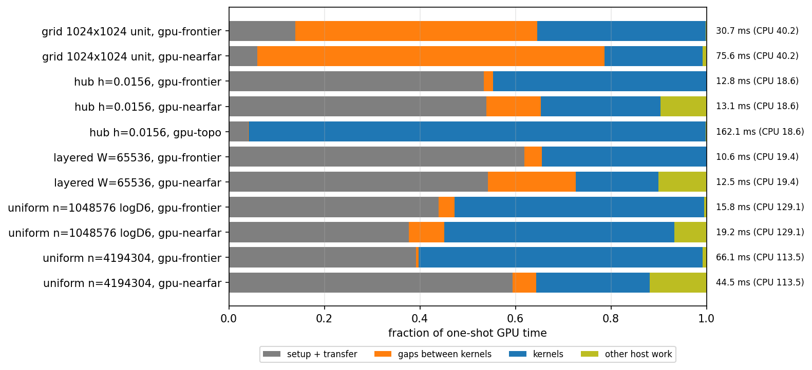

# Results

Everything here was measured on one machine with an RTX 4090 (128 SMs, 72 MB
L2, PCIe 4.0 x16) and an i9 13900KF (8 P cores and 16 E cores, 36 MB L3). The
main study is 27,246 timed runs over 62 graphs, and experiment F adds 803
profiling and placement runs. Every distance array matched an independent
reference, no GPU run overlapped with another process on the GPU, and every run
carries the same code hash. The checks are in `results/published/validation.md`
and every number below comes from the files next to it.

A speedup compares the faster of `gpu-frontier` and `gpu-nearfar` with the
fastest CPU solver that ran on the same graph and source vertex, out of
`dijkstra`, `dial`, `delta` and `delta-omp`. The solvers that sweep the whole
graph every round, `gpu-topo`, `gpu-edge` and `bellman-ford`, ran only in some
experiments and have their own section below. The resident speedup assumes the
graph is already on the GPU, and the one shot speedup includes uploading it.
Both are geometric means over the sources, eight per graph or six in
experiment E.

## Calibration (C0)

Before the experiments, the microbenchmarks in `bin/calibrate` measure the
costs the model relies on. An empty round of the kind `gpu-frontier` runs, a
memset, two kernel launches and one blocking copy back to the host, takes
15.4 µs. A frontier round costs about 1.8 ns per vertex on a degree 8 graph and
2.0 ns per vertex on a degree 4 grid. The cost per vertex is the same at both
degrees, so `gpu-frontier` pays per vertex rather than per edge, which fits the
fact that it gives each vertex a warp of 32 threads. One thread walking a large
hub takes 133 ns per edge. Copying 1 GB to the GPU runs at 16.7 GB/s from
pageable memory and 20.4 GB/s from pinned memory. An empty OpenMP parallel
region with 24 threads costs 2.1 µs.

C0 also chose the CPU thread count. On a 2^22 vertex graph `delta-omp` took
102.9 ms with 24 threads, one per physical core, 98.1 ms with all 32 logical
CPUs and 173.2 ms with 8 threads pinned to the P cores. The rule was to take the
fewest threads within 5% of the fastest, so every experiment used 24. The
measurements and the rule are in `results/raw/C0/cpu_config.json`.

## A. How much parallel work each round has

These are layered graphs with 2^20 vertices and an average degree of 8. Each
layer connects only to the next one, so a search from the first layer moves one
layer per round. The layer width W sets how wide the frontier is, and the
number of layers sets how many rounds there are. W goes from 16 (65,536 layers
with a tiny frontier) to 262,144 (four very wide layers). Each width was run
with unit weights and with weights from 1 to 100 on exactly the same edges. The
plots use Π, the number of useful edges divided by the depth of the shortest
path tree, as the measure of parallelism.


```
layer width                              16     64    256   1024   4096  16384  65536 262144
resident speedup, unit                 0.09   0.35   1.37   5.45   15.7   4.98   6.90   6.49
resident speedup, 1 to 100             0.05   0.15   0.56   2.00   2.66   5.41   4.44   4.02
one shot speedup, 1 to 100             0.05   0.15   0.54   1.77   1.81   2.55   1.83   1.72
gpu-frontier edges per useful edge     1386    460    113   31.8   8.57   3.71   3.25   2.97
  (weights 1 to 100)
```

With unit weights the GPU loses on deep graphs and wins from W = 256 on, so the
crossover lies between Π = 512 and 2,048. With weights from 1 to 100 it moves
to between Π = 1,828 and 7,187. The reason is the last row. `gpu-frontier`
processes vertices in no particular order, so with varying weights it keeps
finding shorter paths to vertices it has already expanded and expands them
again. On the deepest graph it touched 1,386 edges for every one it needed. The
calibrated model assumes no wasted work. For unit weights it puts the crossover
in the same interval as the measurement, and for weighted graphs it puts it
between Π = 459 and 1,828, too early. `gpu-nearfar`, which processes vertices
roughly in distance order, was faster than `gpu-frontier` only at W = 262,144
with weights, and by 2%.



The left plot shows that the BFS frontier width cannot explain the weight
effect, because unit and weighted runs have the same frontier but different
times. The right plot measures the same runs per synchronization, and there
runs with similar work per synchronization take similar time whatever their
weights, for example 30.1 µs at 125,000 edges for unit weights at W = 16,384
and 31.4 µs at 163,000 edges for weighted W = 16. Up to about 32,000 edges per
synchronization `gpu-frontier` costs a flat 14.4 to 14.7 µs per round, a little
less than the empty round measured in C0. Beyond that its cost grows with the work, to about 100 µs
at 500,000 to 700,000 edges.

Two controls at W = 1024 with weights from 1 to 100 changed one more thing.
Numbering the vertices layer by layer instead of randomly made the best CPU
solver, `dial`, 2.8 times faster (98.7 ms down to 35.6 ms) while the GPU stayed
at 48.6 ms, which turned a 2.00x GPU win into a 0.73x loss. Raising the degree
from 8 to 32 made `dial` 2.3 times slower (223.9 ms) while the GPU time rose
only to 51.4 ms, so the speedup rose from 2.00x to 4.43x.

`delta-omp` runs a phase serially when it holds fewer than 4,096 vertices. For
W up to 1024 it ran every phase serially and was 4 to 5% slower than serial
`delta`.

## B. One very long adjacency list

This experiment asks how each GPU solver copes with degree skew. The graphs
have 2^20 vertices and 2^22 undirected edges, and a growing share of the edges
is moved onto a single hub, so the largest degree goes from 26 to about a
million. Each solver is measured against `gpu-edge`, which gives every edge its
own thread. Two RMAT graphs, one with random vertex numbering and one with the
generator's own, serve as a held out check.



```
largest degree                 26     1k     4k    16k    66k   262k     1M
gpu-topo vs gpu-edge         1.43   2.14   5.28   17.1   61.5    148    290
gpu-frontier vs gpu-edge     1.30   1.33   1.43   1.69   2.17   4.74   9.38
```

`gpu-topo` gives each vertex one thread, so a single thread ends up walking the
whole hub. `gpu-frontier` gives each vertex a warp of 32 threads, and its ratio
passes 2 only at a degree of about 65,000, where that of `gpu-topo` passes 2 at
about 1,000. The right plot uses ρ, which compares the time one thread or warp
needs to walk the hub with the time the rest of a round takes, using the
constants from C0. At the largest degree the two curves are 31 times apart, and
at equal ρ they are within 3.5 times of each other. The RMAT points land within
25% of the hub curves at the same ρ. `gpu-edge` itself took 2.5 to 3.2 ms until
the hub held a sixteenth of all edges, and 5.4 ms when it held a quarter. On
the CPU, `delta-omp` stayed about 10 times faster than serial `delta` up to a
degree of 262,000 and was still 6.3 times faster at a million.

## C. Weight distributions

This experiment keeps the edges fixed and changes only the weights. It uses a
uniform random graph with 2^20 vertices, which is shallow, and a 1024 by 1024
grid, which is deep. The weights are unit, log uniform over 1 to 10^D for D of
1, 2, 4 and 6, and uniform over 1 to 100 and over 1 to 100,000. `gpu-nearfar`
and the delta stepping solvers were also run with their bucket width Δ set to
1/16, 1/4, 4 and 16 times the default.



On the uniform graph `gpu-frontier` touched at most 7.6 edges per useful edge.
`gpu-nearfar` was at most 1.5 times faster than it, with log uniform weights
over two decades, and with four or six decades it was slower even with Δ
tuned, because there it touched about as many edges as `gpu-frontier` while
synchronizing 5.5 to 6.4 times as often. The resident speedup on the uniform
graph ranged from 4.9x to 14.3x across the weights.

On the grid the wasted work of `gpu-frontier` grows from none with unit weights
to 244 edges per useful edge with six decades. `gpu-nearfar` lost by 2.9x with
unit weights. With the other six weightings it won by 1.1x to 1.9x when Δ was
tuned, but with the default Δ it lost on four of them. The best Δ was 16 times
the default for four weightings and 1/4 and 1/16 of it for the other two, and
the default cost up to 3.0x. Several of these best values sit at the edge of
the range tried, so the true best may lie further out. The trade shows on the
grid with weights from 1 to 100, where `gpu-nearfar` touched 43 times fewer
edges but synchronized 12.7 times as often, and came out 1.48 times faster with
the best Δ and 1.96 times slower with the default. The resident speedup on the
grid ranged from 0.48x to 1.72x. On the uniform graph the best Δ was 4 or 16
times the default for five of the six weightings, and the default cost at most
1.26x.

Weights from 1 to 100 and from 1 to 100,000 gave times within 10% of each other
for every solver except `dial`, which was 1.4 times slower on the uniform graph
and 3.8 times slower on the grid with the wider range, since its ring of
buckets grows with the largest weight.

## D. Keeping the graph on the GPU

For every graph in A, C, E and HO I computed the break even point, the number
of queries after which uploading the graph once and keeping it on the GPU beats
the CPU. For five graphs I also measured sessions of 128 queries, and compared
them with a CPU batch that answers the same queries on all cores at once.

The break even point was the first query for 37 of the 59 graphs and never for
the other 22. Uploading a graph cost a median of 16% of one CPU query and at
most 52%, and in every case where the GPU was faster per query, its saving on
the first query already covered the upload. When the GPU wins, the one shot
speedup keeps a median of 43% of the resident speedup, and the upload never
turns a win into a loss. The measured sessions matched the prediction for all
10 pairs of graph and GPU solver. Against the CPU batch, the layered graph with
W = 4096 goes from winning on the first query to never winning, while the
layered graph with W = 65,536 and the uniform graph still win from the first
query.

## E. Graph size

Uniform graphs with degree 8 and grids with degree 4 were run from 2^16 to 2^24
vertices with weights from 1 to 100. Three sizes of the uniform graph were
repeated with the caches flushed before every run.



On uniform graphs the resident speedup is 3.4x to 3.8x up to 2^19 vertices,
rises to 8.0x at 2^22 and falls back to 5.4x at 2^24. The right plot shows why.
Per edge touched, `gpu-frontier` costs about 0.14 ns from 2^18 to 2^20
vertices, where the working set reaches 75 MB, about the 72 MB of the L2, and
0.60 ns at 2^24, more than four times as much. `gpu-nearfar`, the faster GPU solver from
2^20 on, goes from 0.30 ns at 2^21 to 0.69 ns at 2^24, while `delta-omp` goes
from 1.11 ns to 1.95 ns. The CPU slows gradually, with no step at its 36 MB L3.

Grids lose up to 2^21 vertices and win from 2^22 (1.17x) to 2^24 (2.34x).
Their Π grows roughly with the square root of the size, from 625 to 10,887, and
they cross over between Π = 3,139 and 4,821, inside the interval where the
weighted layered graphs of A cross.

Flushing the caches before every run changed no time by more than about 1% at
2^20 and 2^22 vertices. At 2^18 it made `delta-omp` 17% slower and `dial` 10%
slower and changed the GPU solvers by about 1%. Copy bandwidth to the GPU from
pageable memory rose from 12.2 GB/s at 1 MB to 16.2 GB/s at 16 MB and 16.7 GB/s
at 1 GB.

## Held out graphs (HO)

These graphs were never used to fit anything. A 1024 by 1024 grid runs at 0.73x
with random numbering and 0.35x with row major numbering, where the CPU is
about twice as fast (47.9 ms against 24.1 ms) and the GPU is not (70.5 ms and
69.4 ms). A geometric graph with the same number of vertices runs at 0.74x, a
uniform random graph at 4.99x and an RMAT graph at 3.53x. Compared with the
weighted layered curve at the same Π, the randomly numbered grid and the
uniform graph land within 12% of it, the RMAT graph 21% below, and the row
major grid and the geometric graph at about half its height.

## The solvers that sweep the whole graph

`gpu-topo`, `gpu-edge` and `bellman-ford` go over the whole graph in every
round, so a query costs them roughly the depth times the number of edges. They
ran in B and HO and in the time breakdown, and `gpu-edge` also ran on the
layered graphs of A with W of 4096 and up. `bellman-ford` ran only in B, where
it took 85 to 256 ms against 12 to 22 ms for `delta-omp`.

On those graphs `gpu-edge` was often the fastest GPU solver. It beat the faster
of `gpu-frontier` and `gpu-nearfar` on all nine graphs in B, by 1.24x with no
hub up to 9.7x with the largest hub, on four of the eight layered graphs in A,
by up to 1.34x, and on four of the five held out graphs, by up to 1.93x on
RMAT. It lost by up to 2.4x on the weighted layered graphs with W = 4096 and
16,384 and by 1.25x on the randomly numbered grid. In A and HO it never changed
which device was faster, but in B it turned the largest hub from a 0.38x loss
for the GPU into a 3.7x win. So where it was measured, the speedups in this
document understate the GPU by as much as 1.93x. It was not run in C, D or E.
`gpu-topo` was slower than the best of the other three GPU solvers on every
graph in B and HO.

## Where the GPU time goes (T)

These runs place an event around every kernel so that GPU time can be split
into setup and transfer, gaps between kernels, and the kernels themselves.
Compared with the same graphs, solvers and sources timed without events, the
events made the GPU solvers up to 22% slower, on the unit weight grid, and
changed the CPU solvers by at most 4%, so these runs are used for nothing else.



On the unit weight grid, `gpu-frontier` spends 51% of its time in the gaps
between kernels, 35% in kernels and 14% on setup, and `gpu-nearfar` spends 73%
in gaps. On the large uniform graph, setup and transfer take from 39% of the
time of `gpu-frontier` to 86% of the time of `gpu-edge`, and every GPU solver
still finishes before `delta-omp`, in 43 to 108 ms against 114 ms. With the big
hub, `gpu-topo` spends 96% of its time in kernels, where a single thread walks
the hub. The slice labelled other host work, 7 to 12% for `gpu-nearfar` on the
uniform, layered and hub graphs, is the time it spends scanning all edge
weights on every query to pick its default Δ, outside the timed phases. In E
that scan took 1.3 ms at 2^20 vertices and 21.3 ms at 2^24 on the uniform
graphs.

## Hardware counters (F)

Nsight Compute was run on representative launches of eight kernels, with one
Nsight Systems timeline and perf on the CPU solvers.

```
kernel                         SM active  occupancy  SM tail  L2 use  sectors/request  bottleneck
grid, unit, gpu-frontier             65%        16%      1.2      7%              1.1  too little parallelism
hub, gpu-topo                         3%        61%     38.4      1%             12.0  load imbalance
hub, gpu-frontier                    58%        47%     50.2     12%              1.3  load imbalance
layered W=256, gpu-frontier          90%        73%      1.1     18%              1.3  memory latency
uniform 2^22, gpu-frontier          100%        83%      1.0      9%              1.3  memory latency
uniform 2^22, gpu-nearfar           100%        78%      1.9     10%              1.3  memory latency
uniform 2^22, gpu-edge              100%        88%      1.0     67%              3.3  bandwidth
uniform 2^22, gpu-topo              100%        87%      1.0     58%             13.7  memory latency
```

SM tail is the busiest SM's active time divided by the average, and the
bottleneck labels come from fixed thresholds in `tools/analyze.py`. The grid
kernel keeps only 16% of the possible warps resident. Over four grid solves
Nsight Systems recorded 35 ms of kernel time and 6,009 blocking copies taking
98 ms. On the hub the busiest SM is active 38 to 50 times as long as the
average. `gpu-edge` on the uniform graph uses 67% of the L2 bandwidth, and
`gpu-frontier` on the uniform and layered graphs keeps most warps resident with
little bandwidth use, which the thresholds label memory latency.

The counters also show why `gpu-edge` beats `gpu-topo` on uniform graphs
although both are balanced. `gpu-topo` needs 13.7 memory sectors per load
request against 3.3, which fits each of its threads reading a different
adjacency list. The active lanes counter reads about 25 of 32 for
`gpu-frontier` on both the degree 4 grid and the degree 8 uniform graph.

On the CPU, `delta-omp` kept on average about one of its 24 threads busy on the
grid, so it ran almost serially, and about 21 of 24 on the large uniform graph.
There its instructions per cycle were 0.25 on P cores and 0.16 on E cores, with
9.1 last level cache misses per thousand instructions against 2.1 on the grid,
which points to memory latency. perf counted 42 to 62% of the serial solvers'
instructions on E cores, but pinning them to one P core changed their times by
about 2% at most.

## The cost model

I fitted GPU solve time as α times the number of synchronizations, plus a cost
per vertex expanded, plus a cost per edge touched, on experiment A only, and
then measured the median error on the other experiments. The A column is the
error on the data the model was fitted to.

```
solver         model                        α (µs)  ns/vertex  ns/edge     A     C     E    HO     B
gpu-frontier   syncs and edges                16.0               0.064   26%   43%   41%   41%   45%
gpu-frontier   syncs, vertices and edges      13.4       0.84    0.015    3%    5%   13%    6%   37%
gpu-nearfar    syncs and edges                 5.6               0.121    7%    8%    8%    8%
gpu-nearfar    syncs, vertices and edges       5.7       0.79    0.026    6%    7%    7%    7%
```

The model in the comment on the counters in `include/sssp/solver.hpp` has only
synchronizations and edges, and for `gpu-frontier` it is off by 26 to 45%. The
three term model adds the cost per vertex. I added that term after seeing the
two term fit, so only its errors outside A say anything about it. It gets
`gpu-frontier` within 5 to 13% on C, E and HO. Its α of 13.4 µs is below both
the 15.4 µs empty round of C0 and the 14.4 µs that rounds with little work took
in A. It fails under heavy skew, with 37% on B, where one
thread or warp walking the hub dominates, and it is weakest on E, whose largest
graphs no longer fit in the L2. For `gpu-nearfar` both forms are within 6 to
8%. `gpu-nearfar` was not run in B.

I also checked how well simple rules pick the faster device, on 260 graph and
source pairs from the 33 graphs in C, E and HO, none of which were used for
fitting. Extra time is the time lost against always choosing correctly, as a
share of the best possible total.

```
rule                                               accuracy  extra time
always CPU                                              37%         96%
always GPU                                              63%         24%
BFS frontier width, fitted on A                         86%          8%
graph properties and calibrated constants               89%          5%
model on the run's own counters, true CPU time          99%       <0.1%
```

Graph properties and the calibrated constants pick the right device 89% of the
time, about as often as the frontier width alone. With a run's actual counters
and the true CPU time the model is right 99% of the time. What the graph does
not tell in advance is how much work an algorithm will waste on given weights,
which A and C show changing on identical edges, and how fast the best CPU
solver will be, since its time per useful edge varies 24 times across these
graphs, from 1.4 to 34 ns.

## Limitations

These results come from one CPU and one GPU. The GPU solvers synchronize with
the host every round, so the synchronization cost measured here belongs to that
design and not to GPUs in general. `gpu-nearfar` recomputes its default Δ on
every query by scanning the weights on the host outside the timed phases, which
the analysis counts as part of the one time cost, and I left the code alone so
it matches the data. The headline speedups leave out `gpu-edge`, which was
faster on many shallow graphs. The machine is shared. The experiment script
waits whenever another process is on the GPU, which did not happen during this
run, but CPU load from other users cannot be ruled out, and the load average is
recorded with every run. With eight sources per graph,
graphs where the result depends a lot on the source have wide confidence
intervals, for example 3.2x to 4.0x for the held out RMAT graph against 4.9x to
5.0x for the uniform graph.
